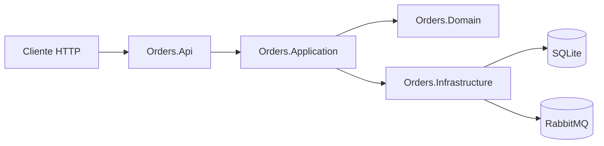

# orders-api

Microsserviço em .NET 8 para criação de pedidos com persistência em SQLite e publicação de evento `OrderCreated` no RabbitMQ.

## Arquitetura



## Endpoints

- `POST /orders`
- `GET /health`
- `GET /health/live`

## Banco e migrações

O startup aplica migrations automaticamente com `dbContext.Database.MigrateAsync()`.

## Configuração

Use variáveis de ambiente para credenciais/configuração:

- `ConnectionStrings__OrdersDb`
- `RabbitMq__HostName`
- `RabbitMq__Port`
- `RabbitMq__UserName`
- `RabbitMq__Password`
- `RabbitMq__ExchangeName`

## Rodar local

```bash
dotnet restore
dotnet build
dotnet run --project src/Orders.Api/Orders.Api.csproj
```

## Docker Compose

```bash
docker compose up --build
```

- API: `http://localhost:8080`
- RabbitMQ UI: `http://localhost:15672`

## Testes

```bash
dotnet test tests/Orders.Tests/Orders.Tests.csproj --collect:"XPlat Code Coverage"
```

Cobertura alvo: `>= 81%`.
