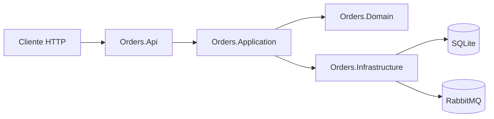

# orders-api

Microsserviço em .NET 8 para criação de pedidos com persistência em SQLite e publicação de evento `OrderCreated` no RabbitMQ.

## Estrutura de pastas

```text
.
├── Dockerfile
├── OrdersApi.sln
├── src
│   ├── Orders.Api
│   │   ├── Controllers
│   │   ├── Middleware
│   │   ├── appsettings.json
│   │   └── Program.cs
│   ├── Orders.Application
│   │   ├── Abstractions
│   │   ├── DTOs
│   │   └── Services
│   ├── Orders.Domain
│   │   ├── Entities
│   │   ├── Events
│   │   ├── Exceptions
│   │   └── Repositories
│   └── Orders.Infrastructure
│       ├── DependencyInjection
│       ├── Messaging
│       ├── Persistence
│       └── Repositories
└── tests
    └── Orders.Tests
        ├── Api
        ├── Application
        ├── Domain
        └── Infrastructure
```

## Diagrama de arquitetura



## Fluxo do pedido

1. Cliente chama `POST /orders`.
2. Controller delega para `OrderService`.
3. `OrderService` cria entidade `Order` com validações de domínio (`customerId`, `totalAmount > 0`).
4. Pedido é persistido via `IOrderRepository`.
5. Evento `OrderCreated` é publicado via `IOrderEventPublisher`.
6. Métrica `orders_created_total` é incrementada.
7. Logs estruturados são emitidos com Serilog.

## Endpoint disponíveis

- `POST /orders`
- `GET /health` (health checks ASP.NET)
- `GET /health/live` (liveness simples via controller)

### Payload de criação

```json
{
  "customerId": "customer-123",
  "totalAmount": 199.9
}
```

### Evento publicado

```json
{
  "orderId": "guid",
  "customerId": "customer-123",
  "totalAmount": 199.9,
  "createdAt": "2026-01-01T10:00:00Z"
}
```

## Estratégia de consistência eventual

A gravação em banco e a publicação do evento ocorrem na mesma operação de aplicação, mas **não** na mesma transação distribuída. Isso evita acoplamento com 2PC e mantém simplicidade operacional.

**Estratégia sugerida para evolução (produção):**
- Implementar **Outbox Pattern** na camada de infraestrutura.
- Persistir evento numa tabela outbox na mesma transação do pedido.
- Processo assíncrono publica mensagens pendentes e marca como entregues.
- Reprocessamento com idempotência para tolerar falhas do broker.

## Observabilidade

- **Logs estruturados** com Serilog.
- **Health check** em `/health`.
- **Métrica simples**: contador `orders_created_total`.
- **Tracing distribuído preparado** com OpenTelemetry (`AspNetCore`, `HttpClient`, Console exporter).

## Decisões técnicas

1. **DDD leve**: entidade com invariantes no domínio.
2. **Repository Pattern**: abstração em Domain, implementação em Infrastructure.
3. **Clean architecture por camadas**: API, Application, Domain e Infrastructure.
4. **SQLite default**: reduz fricção local; fácil troca para PostgreSQL via provider EF Core.
5. **RabbitMQ publisher dedicado**: separa integração externa da aplicação.
6. **Middleware global de exceção**: padroniza erros e logging.

## Trade-offs

- SQLite simplifica setup, porém não é ideal para alta concorrência.
- Publicação direta no RabbitMQ é simples, mas requer Outbox para maior resiliência.
- Console exporter (OpenTelemetry) é ótimo para dev; em produção, usar OTLP/Jaeger/Tempo.

## Como rodar localmente

### Pré-requisitos
- .NET 8 SDK
- RabbitMQ (opcional para validar publicação real)

### Comandos

```bash
dotnet restore
dotnet build
dotnet run --project src/Orders.Api/Orders.Api.csproj
```

API em `http://localhost:5000` ou porta definida no ambiente.

## Testes e cobertura

```bash
dotnet test tests/Orders.Tests/Orders.Tests.csproj --collect:"XPlat Code Coverage"
```

Meta de cobertura: **>= 81%**.
